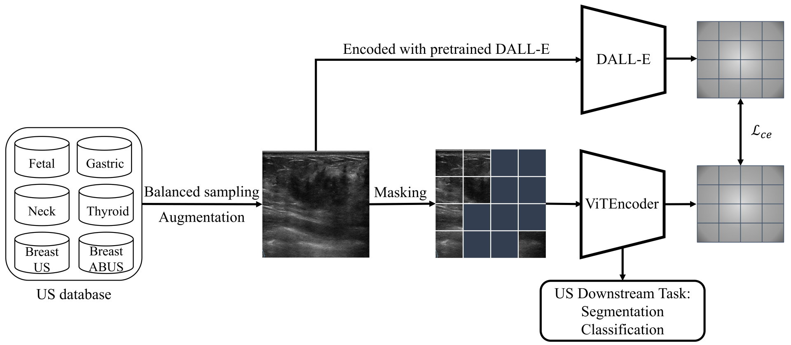
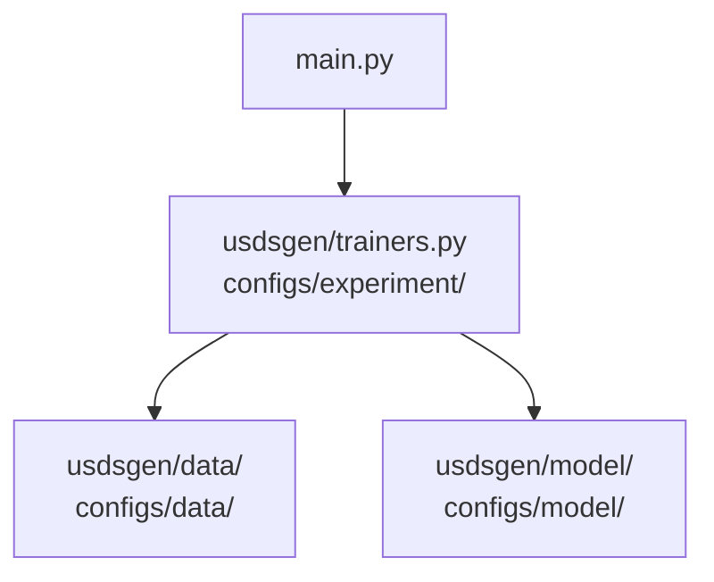

---

<div align="center">

# UltraSound Foundation Model (USFM)

<a href="https://pytorch.org/get-started/locally/"></a>
<a href="https://pytorchlightning.ai/"></a>
<a href="https://hydra.cc/"></a>
<a href="https://github.com/ashleve/lightning-hydra-template"></a><br>

</div>

---

### ✨✨✨ Version V2 updates the code structure to make it more user-friendly for users to customize their own datasets, model structures, and training processes.

---

### ✨✨✨ Latest USFM weight!

The latest weight of USFM has been released ([USFM_latest.pth](https://drive.google.com/file/d/1KRwXZgYterH895Z8EpXpR1L1eSMMJo4q/view?usp=sharing)).

---

## 💡 Introduction

### Highlights：

1. USFM is the first foundation model for medical ultrasound images, developed and maintained by the Laboratory of Medical Imaging and Artificial Intelligence, Fudan University.

2. USFM aims to accelerate the modeling of existing medical ultrasound image analysis tasks with high performance and efficiency (less labeled data and fewer training epochs).

3. The superior capability of USFM comes from unsupervised pre-training on a large multi-organ, multi-center, multi-device ultrasound database, which contains two million ultrasound images from different ultrasound devices around the globe, which guarantees the generalizability and versatility of USFM.

4. To adapt to the characteristics of ultrasound images, the unsupervised pre-training of the USFM is based on Mask Image Modeling (MIM) with the addition of frequency domain mask learning, which captures the image texture features well.

5. Experiments validate the excellent performance and labeling efficiency of USFM on common disease classification, tissue segmentation and image enhancement tasks. More tasks are in progress.



### Paper

[J. Jiao et al., “USFM: A universal ultrasound foundation model generalized to tasks and organs towards label efficient image analysis,” Medical Image Analysis, vol. 96, p. 103202, Aug. 2024, doi: 10.1016/j.media.2024.103202.](https://www.sciencedirect.com/science/article/pii/S1361841524001270)


## 📌 Configuring the runtime environment

### 1. Configuring the project

```bash
# clone project
git clone https://github.com/openmedlab/USFM.git
cd USFM

# [OPTIONAL] create conda environment
conda create -n USFM python=3.9
conda activate USFM

# install pytorch according to instructions
# https://pytorch.org/get-started/
pip install torch==2.4.1 torchvision==0.19.1 torchaudio==2.4.1 --index-url https://download.pytorch.org/whl/cu118

# install requirements
pip install -r requirements.txt

# install mmcv
pip install mmcv==2.2.0 -f https://download.openmmlab.com/mmcv/dist/cu118/torch2.4/index.html


# install mmsegmentation [important: from modified mmseg]
mkdir -p useful_modules
cd useful_modules
git clone git@github.com:George-Jiao/mmsegmentation.git
cd mmsegmentation
git checkout gj_mmcv2_2_0
pip install -v -e .
cd ../..

```

### 2. Installing usdsgen (US DownStream Generalizer)

usdsgen is a USFM-based ultrasound downstream task generalization package that can be used for downstream tasks on ultrasound images.

```bash
pip install -v -e .
```

## 📦️ Data preparation

### 1. Datasets Folder

You can save datasets in either folder, the default is the folder \[datasets\].

The folder format is generally:

```bash
datasets/
    ├── Seg/
        ├── dataset_names/
            ├── trainning_set/
                ├── image/ img1.png..
                ├── mask/ img1.png..
            ├── val_set/
                ├── image/
                ├── mask/
            ├── test_set/
                ├── image/
                ├── mask/
    |── Cls/
        ├── dataset_names/
            ├── trainning_set/
                |── class1/
                |── class2/
            ├── val_set/
                |── class1/
                |── class2/
            ├── test_set/
                |── class1/
                |── class2/
```

\*\*\*\* Advanced: data configuration in folder \[configs/data/\]

### 2. An example toy dataset for segmentation task

Download the Seg_toy_dataset from Google Drive [Seg_toy_dataset.tar.gz](https://drive.google.com/file/d/1E3e7mTBdIxj4UOfeUrEFM6GgryXylodG/view?usp=sharing) and save it in folder \[./datasets\].

\*\* The toy dataset is just for running purposes only, containing 199 images for training, 50 images for validation, and 50 images for testing.

```bash
mkdir -p ./datasets/Seg/
tar -xzvf ./datasets/Seg_toy_dataset.tar.gz -C ./datasets/Seg/
```

## 🚀 Finetuning USFM on the downstream dataset

### 1. Download the USFM weights

Download the USFM weight from Google Drive [USFM_latest.pth](https://drive.google.com/file/d/1KRwXZgYterH895Z8EpXpR1L1eSMMJo4q/view) and save it in \[./assets/FMweight/USFM_latest.path\].

### 2. Finetuning USFM for the downstream task

```bash
# setting the environment variable
export batch_size=16
export num_workers=4
export CUDA_VISIBLE_DEVICES=0,1,2
export devices=3 # number of GPUs
export dataset=toy_dataset
export epochs=400
export pretrained_path=./assets/FMweight/USFM_latest.pth
export task=Seg   # Cls for classification, Seg for segmentation
export model=Seg/SegVit # SegVit or Upernet for segmentation, vit for classification

# Segmentation task
python main.py experiment=task/$task data=Seg/$dataset data="{batch_size:$batch_size,num_workers:$num_workers}" \
    model=$model model.model_cfg.backbone.pretrained=$pretrained_path \
    train="{epochs:$epochs, accumulation_steps:1}" L="{devices:$devices}" tag=USFM


# Classification task
export task=Cls
export model=Cls/vit
python main.py experiment=task/$task data=Cls/$dataset data="{batch_size:$batch_size,num_workers:$num_workers}" \
    model=$model model.model_cfg.backbone.pretrained=$pretrained_path \
    train="{epochs:$epochs, accumulation_steps:1}" L="{devices:$devices}" tag=USFM
```

## 📈 Results Folder

The results of the experiment are saved in the logs/fineturne folder.

## 🙋‍♀️ Advanced: Code Structure



\*\*\*\* You can conveniently configure different models, datasets, and training processes in the usdsgen and configs folder.

## 🛡️ License

This project is under the CC-BY-NC 4.0 license. See [LICENSE](LICENSE) for details.

## 🙏 Acknowledgement

Our code is based on [transformer](https://github.com/huggingface/transformers), [pytorch-image-models
](https://github.com/huggingface/pytorch-image-models), and [lightning-hydra-template
](https://github.com/ashleve/lightning-hydra-template). Thanks them for releasing their codes.

## 💚 Contribution

Have a question? Found a bug? Missing a specific feature? Feel free to file a new issue, discussion or PR with respective title and description.

Please perform a code check before committing with the pre-commit hooks.

```bash
# pip install pre-commit
pre-commit install
pre-commit run -a
```

## Citation

If you find the USFM or this project useful in your research, please consider cite:

```bibtex
@article{JIAO2024103202,
title = {USFM: A universal ultrasound foundation model generalized to tasks and organs towards label efficient image analysis},
journal = {Medical Image Analysis},
volume = {96},
pages = {103202},
year = {2024},
issn = {1361-8415},
doi = {https://doi.org/10.1016/j.media.2024.103202},
url = {https://www.sciencedirect.com/science/article/pii/S1361841524001270},
author = {Jing Jiao, Jin Zhou, Xiaokang Li, ..., Yuanyuan Wang and Yi Guo},
keywords = {Ultrasound image, Foundation model, Label efficiency, Task adaptability},
}
```
